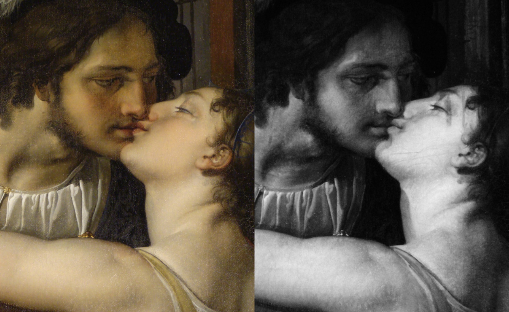

 

    
    <h3 align="center">IR Spectroscopy video</h3>
    

    Through this video, we delve into the basics of IR spectroscopy, highlighting its relevance in arts.
    

# How to render the video ?

To render the video, we used the [Manim](https://www.manim.community/) library and every underlying library
(like [FFmpeg](https://www.ffmpeg.org/), [Numpy](https://www.numpy.org/)). For detailed requirements, see ``requirements.txt``.

To render a scene, you can use the following command :
> manim -pqh main.py [SceneToRender]

# Where can I see the video ?

Sadly, this video with explanation isn't available on any platform for personal reason. This repository is only used as an archive for this project.
